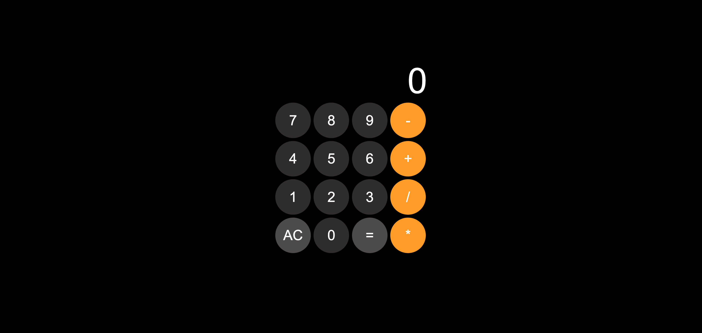

# Simple Calculator



## Table of Contents

- [Simple Calculator](#simple-calculator)
  - [Table of Contents](#table-of-contents)
  - [Introduction](#introduction)
  - [Features](#features)
  - [Technologies Used](#technologies-used)
  - [Installation](#installation)
  - [Usage](#usage)
  - [Planning](#planning)
    - [1. Brainstorming](#1-brainstorming)
    - [2. Prioritizing](#2-prioritizing)
    - [3. User Story Dependencies](#3-user-story-dependencies)
    - [4. Acceptance Criteria](#4-acceptance-criteria)
    - [5. Defining Tasks](#5-defining-tasks)
    - [6. Project Board](#6-project-board)
    - [7. Sprinting and Reviewing](#7-sprinting-and-reviewing)
  - [Contributing](#contributing)
  - [License](#license)

---

## Introduction

This is a simple calculator web application that allows users to perform basic
arithmetic operations such as addition, subtraction, multiplication, and
division. The project follows an organized development strategy to ensure a
smooth and structured implementation.

---

## Features

- Basic arithmetic operations (+, -, \*, /)
- Reset button (AC) to clear the display
- Interactive UI with button-based input
- Error handling for invalid operations
- Dynamic updating of the display

---

## Technologies Used

- HTML
- CSS
- JavaScript

---

## Installation

To run this project locally, follow these steps:

1. Clone this repository:

   ```sh
   git clone https://github.com/gritchin-artur/simple-calculator.git
   ```

2. Navigate to the project directory:

   ```sh
   cd simple-calculator
   ```

3. Open the `index.html` file in your browser or use Live Server in VS Code.

---

## Usage

1. Click on the numeric buttons to enter numbers.
2. Use the arithmetic buttons (+, -, \*, /) for calculations.
3. Click `=` to evaluate the expression.
4. Click `AC` to clear the display.

---

## Planning

This project follows a structured planning approach:

### 1. Brainstorming

- The app provides a simple and interactive way to perform arithmetic calculations.
- The target users are anyone who needs a basic calculator.

### 2. Prioritizing

- The core functionality (basic arithmetic) is the highest priority.
- UI/UX improvements and additional features (such as history tracking) can
  be considered for future updates.

### 3. User Story Dependencies

- Number input must work before implementing calculations.
- The display must update dynamically as users interact with the calculator.

### 4. Acceptance Criteria

- Users can input numbers and operators.
- The calculator correctly evaluates expressions.
- The `AC` button clears the display.
- Invalid operations return an error message.

### 5. Defining Tasks

- Implement number and operator buttons.
- Create a function to process user inputs.
- Update the UI dynamically.
- Implement error handling.

### 6. Project Board

- A project board is used to track tasks and issues.

### 7. Sprinting and Reviewing

- The development is divided into manageable tasks to ensure efficient progress.

---

## Contributing

Contributions are welcome! If you’d like to improve this project:

1. Fork the repository.
2. Create a new branch:

   ```sh
   git checkout -b feature-branch
   ```

3. Make your changes and commit:

   ```sh
   git commit -m "Add new feature"
   ```

4. Push to the branch:

   ```sh
   git push origin feature-branch
   ```

5. Open a Pull Request.

---

## License

This project is open-source and available under the MIT License.

> - What user needs and business problem does this app cover?
> - Who is the user?
> - What is the business?
